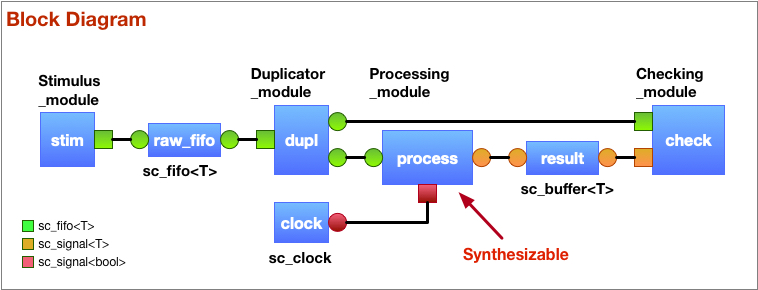

<!-- @file README.md -->
<!-- For doxygen --> \mainpage
# Modern SystemC Project

Illustrate various C++11/14/17 techniques with SystemC 2.3.2. This project is hosted on github at https://github.com/dcblack/ModernSystemC.git .

## Design

A simple design was chosen to illustrate a variety of features. Basically
a processing module takes a 3-D vector (x, y, z) coordinate and outputs its
magnitude. Fixed-point numbers are demonstrated.

Key features of C++ that are illustrated include:

- Uniform initialization, std::initializer_list
- std::unique_ptr, std::valarray, std::default_random_engine
- for-each loop
- auto type inference
- Explicit default implementation
- Override safety
- User-defined literals (sc_time)

Verification features include:

- Random input
- Objection mechanism to determine end of simulation
- Checking error counts for PASS/FAIL determination

#### Challenge

Identify as many features from the preceding as you are able. If you are familiar with C++98/03, but unfamiliar with C++11 and beyond, I highly recommend getting a book on the topic. The following are some favorites in my library in no particular order:

- [C++ Rocks by Alex Korban](https://cpprocks.com)
- [Effective Modern **C**++: 42 Specific Ways to Improve Your Use of **C**++**11** and **C**++14 by Scott Meyers](https://www.amazon.com/gp/product/B00PGCMGDQ/ref=ppx_yo_dt_b_search_asin_title?ie=UTF8&psc=1)
- [The C++ Programing Language by Bjarne Stroustrup](https://read.amazon.com/kp/embed?asin=B00DUW4BMS&preview=newtab&linkCode=kpe&ref_=cm_sw_r_kb_dp_wKg7CbZR8QJNX)

## Block diagram



## About the code

Here are a few more notes about the implementation.

`main.cpp` contains the entry point for SystemC as usual. It also
contains a few novel features.

The command-line arguments are parsed and placed into a simple string
mapping. There are two options used:

- `-d` increases verbosity to `SC_DEBUG` level.
- `-x` exists early just after initial testing of the sqrt function

There is a brief directed test of the `fpsqrt` (fixed-point square root)
function.

The behavior of standard error messages is changed to avoid C++ exceptions,
which tend to complicate coding.

After simulation has completed, we check if `sc_stop` was called and invoke
it if not, which allows `end_of_simulation` callbacks to run.

The exit status of simulation is contingent on whether or not any error or
fatal messages were issued during simulation.

## About building

This project is based on using the `cmake` tool (See <https://cmake.org>)
and creation of all build artifacts in the `build/` subdirectory.

#### Prerequisites

This project requires a moder C++ compiler such as g++ (part of GCC) or clang++ (part of llvm). Additionally, automation and documentation require the following:

1. GNU make, Ninja, CDT Eclipse or Xcode (only tested on make and ninja as of this writing)
2. cmake
3. doxygen and dot if you want to generate documentation
4. typora for nice rendering of markdown
5. bash, perl, and usual Linux suspects

#### Scripts

A simple `build` script was created to further automate the process if working under
**bash**. The script and some related pieces are located in the accompanying `bin/`
subdirectory. To get help on the script itself, invoke using the conventional `--help`
option (or simply examine the script yourself). The easiest way to use this is by
putting the local `bin/` directory in your search path:

```bash
env PATH=$PATH:$(pwd)/bin
```

There is also the assumption you have SystemC 2.3.1 or later compiled and installed
using a modern version of C++. Nicely enough, SystemC now has basic support for `cmake`
itself.


### Building SystemC

You can obtain source for SystemC from <https://www.accellera.org/downloads/standards/systemc>. Registration is required, but you need not worry about SPAM.

Make certain your compiler supports C++14 (or better). Most compilers support the`--version` option.

Expand the downloaded gzip and create a `build/` subdirectory within it:

```bash
tar xf systemc-2.3.3.tgz
mkdir systemc-2.3.3/build
cd systemc-2.3.3
ccmake ..
```
The following screen will appear. Make sure you set the **CMAKE_CXX_STANDARD** to at least **14** and the **CMAKE_INSTALL_PREFIX** should be a <u>full path</u> to an install directory (it cannot be relative). You may optionally turn on **BUILD_SOURCE_DOCUMENTATION** (assuming you have doxygen and dot installed).
```
                                                    Page 1 of 1
 BUILD_SHARED_LIBS                ON
 BUILD_SOURCE_DOCUMENTATION       OFF
 CMAKE_BUILD_TYPE                 Release
 CMAKE_CXX_STANDARD               14
 CMAKE_EXECUTABLE_FORMAT          MACHO
 CMAKE_INSTALL_PREFIX             /DESIRED/INSTALLATION/PATH/systemc
 CMAKE_OSX_ARCHITECTURES
 CMAKE_OSX_DEPLOYMENT_TARGET
 CMAKE_OSX_SYSROOT
 ENABLE_PTHREADS                  OFF
 INSTALL_LIB_TARGET_ARCH_SYMLIN   OFF
 INSTALL_TO_LIB_BUILD_TYPE_DIR    OFF
 INSTALL_TO_LIB_TARGET_ARCH_DIR   OFF
 SystemC_TARGET_ARCH              macosx64


CMAKE_CXX_STANDARD: C++ standard to build all targets. Supported values are 98,
Press [enter] to edit option Press [d] to delete an entry   CMake Version 3.14.4
Press [c] to configure
Press [h] for help           Press [q] to quit without generating
Press [t] to toggle advanced mode (Currently Off)
```

Before exiting the above, use [**c**] to configure followed by [**g**] to generate, and [**q**] to quit.

```bash
cmake ..
make          # Note: you may safely ignore warnings
make check    # Despite warnings, tests should all pass.
make install
cd ../..
export SYSTEMC=/DESIRED/INSTALLATION/PATH/systemc
```

You are now ready to proceed back to compiling and executing the project.

### Compiling and executing the project

Assumes C++ compiler with support for C++14 or newer and SystemC
2.3.2 or newer pointed to by `$SYSTEMC_HOME`.

Build and execute with the `build` script (located in the bin/ directory):

```sh
build -run -- -d
```

Alternately, do it by hand:

```sh
mkdir -p build
pushd build
rm -f *.log
cmake -G 'Unix Makefiles' .. 2>&1 | tee build.log
make docs 2>&1 | tee -a build.log
make modern 2>&1 | tee -a build.log
env LD_LIBRARY_PATH=$SYSTEMC/lib* ./modern 2>&1 | grep -v ^$ | tee run.log
popd
```

<!--///* The end *///-->